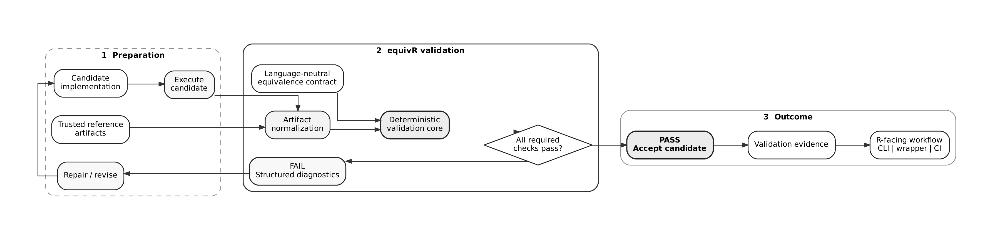

# equivR: Reproducible Cross-Runtime Equivalence for R Analytics

*R Consortium ISC 2026-2 grant proposal — convenience combined Markdown copy.*

# Executive Summary

R is becoming an important open-source option for clinical-trial analysis and regulatory submissions, but long-term reviewability remains a practical challenge as packages, runtimes, and dependencies change. Environment preservation helps, but some analytical workflows eventually need to be refactored or migrated rather than frozen in place.

`equivR` addresses that next step: modernize trusted analytical code while independently verifying that its analytical behavior is preserved.

> **Generation proposes; validation decides.**

Phase 1 will first demonstrate SAS -> R modernization using pregenerated trusted SAS reference artifacts, then apply the same workflow to legacy R -> modern R. Over four months, the project will deliver an open-source `equivR` core under MPL-2.0 with deterministic equivalence validation, structured diagnostics, a model-independent LLM repair loop, R-friendly local/CI workflows, and reproducibility evidence.

# Signatories

## Project team

**Yonglin Zhu** — co-PI / co-lead. Led a completed SAS-to-Python modernization framework combining AI-assisted transformation with numerical-equivalence validation. Leads architecture, contract design, and the validator.

**Xing Cai** — co-PI / co-lead. Founding member of the R Working Group at PPD, working across SAS and R analytics. Leads use-case design, benchmarks, testing, and documentation.

`equivR` is independent open-source work, not sponsored, funded, or endorsed by either co-PI's employer, and does not use employer-owned code, data, or infrastructure.

## Contributors

The co-PIs have already prepared this proposal and a public prototype at <https://github.com/zhuygln/equivR>: a base-R proof of concept with worked examples, a Phase 1 implementation plan, and early contract-v1 validation code with tests and CI. Community contributions will be invited through the repository.

## Consulted

The design is informed by public R Consortium Submissions Working Group materials [@reviewable2026; @submissions2026; @pilot5]; citation does not imply endorsement.

# The Problem

Recent R Consortium discussion on making R submissions reviewable for FDA highlights a practical challenge: reviewers may receive R code but still struggle to recreate the sponsor's environment, install dependencies, or reproduce submitted results [@reviewable2026]. As R becomes a more important open-source option for clinical-trial analysis, reviewability and reproducibility matter as much as whether the code runs.

The R Submissions Working Group is addressing this through approaches such as containers and WebAssembly, while also planning greater use of AI and automation in future submission pipelines [@submissions2026].

Preserving an old environment does not solve every long-term problem. R versions and packages change, legacy code becomes hard to maintain, and organizations eventually need to refactor or migrate analytical workflows. The question then becomes:

> Can we change the implementation while preserving the analytical behavior that made the original workflow trustworthy?

Today, teams usually answer this with project-specific comparison scripts and manual review. There is no common infrastructure for defining what must remain equivalent and checking it across legacy R, modern R, SAS, Python, or AI-assisted rewrites.

Large language models make modernization easier, but they cannot be trusted to validate their own output. `equivR` targets this missing layer: LLM-assisted modernization combined with independent equivalence validation, so analytical workflows can evolve while remaining reproducible, reviewable, and trustworthy.

# The proposal

## Overview

`equivR` will let teams modernize analytical code while keeping the trusted implementation as the authority for what must not change.

The first target is SAS -> R. A trusted SAS workflow provides reference artifacts; an LLM produces or repairs an R implementation; `equivR` validates the R outputs against the SAS reference and returns structured diagnostics on failure. A candidate is accepted only when all declared checks pass. The same framework is then applied to legacy R -> modern R.

For the R community, this offers a second path to long-term reviewability: instead of preserving an old runtime indefinitely, a workflow can be modernized with verifiable evidence that its analytical behavior is unchanged.

## Detail

The project separates code generation from acceptance: an LLM may propose a refactor, translation, or repair, but only deterministic `equivR` validation decides whether the result preserves the trusted analytical behavior (Figure 1).

### Minimum Viable Product

The Phase 1 MVP will let a user:

1. provide trusted reference artifacts and an R candidate;
2. define an equivalence contract (keys, schema, missingness, categorical values, numerical tolerances, selected analytical results);
3. run deterministic validation locally or in CI, with PASS/FAIL status and structured diagnostics; and
4. feed failures into a bounded LLM repair and re-validation loop.

Two public examples will be delivered: SAS -> R, using pregenerated SAS reference artifacts; and legacy R -> modern R, using the same framework.

### Architecture

1. **LLM modernization interface** — model-independent generation and repair.
2. **Equivalence contract** — machine-readable definition of the behavior to preserve.
3. **Runtime/artifact layer** — executes the R candidate and normalizes candidate and reference outputs.
4. **Deterministic validator and evidence** — applies the contract, blocks acceptance on any required failure, and emits diagnostics and reproducibility evidence.

A thin R-friendly command or wrapper exposes the workflow without requiring users to touch orchestration internals.

### Assumptions

- Trusted reference artifacts are available.
- Important behavior can be expressed through datasets and selected results, with acceptable differences (such as tolerances) stated explicitly.
- General-purpose LLMs can produce useful candidate transformations from source code and validation diagnostics.

If an LLM cannot complete a transformation, `equivR` can still validate a human-written or externally generated candidate; unsupported behavior is documented rather than treated as verified.

### External dependencies

The project uses open-source R/Python libraries, standard CI tooling, and access to a general-purpose LLM, without depending on a particular vendor or model family. SAS is needed only to pregenerate the trusted reference artifacts; public CI will not require licensed SAS software. Proprietary model API costs will be self-funded or provided in kind.

# Project plan

## Start-up phase

**Month 1.** Finalize governance and MPL-2.0 licensing, define the first equivalence-contract format, implement the initial deterministic validator, and prepare the SAS -> R benchmark with pregenerated reference artifacts. By the end of Month 1, `equivR` should take a reference artifact, an R candidate result, and a contract, and return deterministic PASS/FAIL status with structured diagnostics.

## Technical delivery

| Milestone | Timing | Deliverable | Amount |
|----|------|------------------------------|-----:|
| M1 | Month 1-2 | Equivalence contract, deterministic validation, diagnostics, tests | $1,250 |
| M2 | Month 1-2 | SAS -> R modernization demonstration | $1,000 |
| M3 | Month 2-3 | Legacy R -> modern R, R-friendly invocation, CI, benchmark format | $1,000 |
| M4 | Month 3-4 | Model-independent bounded LLM repair loop and reproducibility evidence | $750 |
| M5 | Month 4 | Documentation, examples, release hardening, tagged release | $1,000 |

**Failure recovery.** If an LLM cannot produce a correct candidate, we will narrow or manually repair the example while preserving the validation experiment. Unsupported SAS/R behavior will be documented as out of scope. Model-provider failure will not affect deterministic CI, and the repair loop stops after a bounded number of attempts.

## Other aspects

Development will be public under MPL-2.0, with feedback and benchmark contributions through the repository. Phase 1 stays narrow: two small benchmark cases, artifact-based validation, and no live SAS in CI.

## Budget & funding plan

**Total requested: $5,000.** Milestone amounts are shown above.

No grant funds are requested for travel, workshops, hardware, publication fees, cloud services, AI credits, indirect costs, or licensed SAS software.

# Success

## Definition of done

Phase 1 is done when the SAS -> R and legacy R -> modern R workflows both run from a clean checkout, use explicit equivalence contracts, and produce deterministic diagnostics and reproducible validation evidence.

No live SAS runtime is required in CI. The repair loop is model/provider independent, and the LLM never determines acceptance.

## Measuring success

- Both benchmark cases reproduce from a clean checkout, including SAS -> R using pregenerated trusted artifacts.
- Every required mismatch fails with actionable diagnostics.
- R-friendly local/CI invocation produces reproducibility metadata and machine-readable evidence.
- An initial public release is published.

The goal is not to show that an LLM can translate every analytical program. The goal is to show that modernization can be made verifiable: generation may vary, but acceptance remains deterministic.

## Future work

The framework can extend to more SAS -> R and Python -> R cases, richer analytical result types, live runtime adapters, repository-scale modernization, and more automated repair, with the benchmark suite growing through community contributions.

# References

R Consortium. 2026a. "Making R Submissions Reviewable for FDA." <https://r-consortium.org/posts/making-r-submissions-reviewable-for-fda/>

R Consortium. 2026b. "R Submissions Working Group: 2026 Plans." <https://r-consortium.org/posts/submissions-wg-2026/>

R Consortium. 2026c. "Submissions Pilot 5 Dataset-JSON Repository." <https://github.com/RConsortium/submissions-pilot5-datasetjson>
